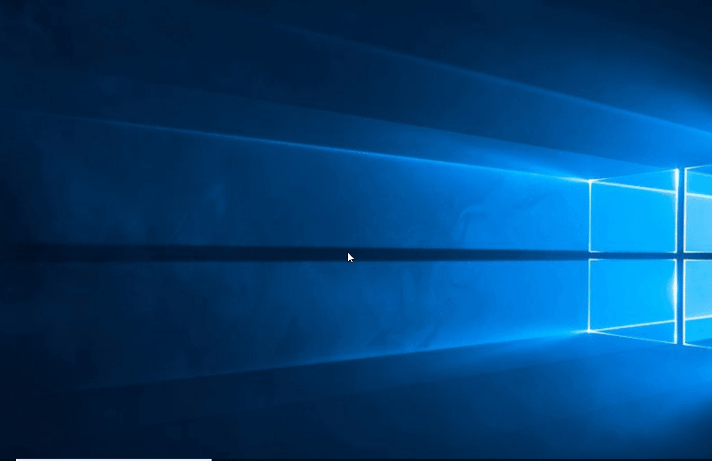

# What is this

This repository contains contains my final project for **COMP2215** module for **University of Southmapton**.

### In short...
Creates a [rubber ducky](https://shop.hak5.org/products/usb-rubber-ducky-deluxe) using a Atmel microcontroller, parses a DuckyScript file and creates a hex file to flash on the microcontroller.

### More detailed...

That is a hacky implementation of the [DuckyScript](https://github.com/hak5darren/USB-Rubber-Ducky/wiki/Duckyscript) language that works for the [Atmel AT90USB1286 microcontroller](https://www.microchip.com/wwwproducts/en/AT90USB1286).
You can find the schematics of the LaFortuna board [here](https://github.com/ViktorBarzin/LaFortunaRubberDucky/blob/master/lafortuna-schem.pdf) and the datasheet for the microcontroller [here](https://github.com/ViktorBarzin/LaFortunaRubberDucky/blob/master/at90usb1286_doc7593.pdf) or on Atmel's website.

The *LaFortuna* board has a *USB controller* which is used in **Device Controller** mode (aka *client mode*)
 (p. 246 in the datasheet), simulates a *USB keyboard* and simulates key presses that are based on the ducky script code.

**The C code is based on the keyboard demo provided on [Atmel's website](https://www.microchip.com/wwwAppNotes/AppNotes.aspx?appnote=en591888)**. I highly recommend understanding the code before trying to tweak it.

#### C details
The main change is in `keyboard_task.c` where I've added some custom logic for parsing key presses.
The keys that are going to be pressed are stored in an array called `usb_keys`.
The HID values of each key can be found in `usb_commun_hid.h` (a neat table with the values can be found [here](https://gist.github.com/MightyPork/6da26e382a7ad91b5496ee55fdc73db2)).

# Demo

The script:
```
DELAY 3000
WINDOWS r
DELAY 500
STRING notepad
DELAY 500
ENTER
DELAY 2750
STRING Hello World!
ENTER
```
produces the expected hello world example once the board is plugged in:



# Requirements

1. [Python 3.7+](https://www.python.org/downloads/release/python-370/) to parse DuckyScript and adjust the C file
2. [Gnu make](https://www.gnu.org/software/make/) to make the project
3. [dfu-programmer](https://dfu-programmer.github.io/) to flash the *.hex* file on the microcontroller

# How to run your own DuckyScript program

1. Run ```python rubber_ducky_to_hex.py```
This will read the contents of ```duckyScript.txt```, parse it and make the `payload.hex` file that you should afterwards flash to your microcontroller.
2. Run ```sudo dfu-programmer at90usb1286 erase && sudo dfu-programmer at90usb1286 flash payload.hex``` to erase and reflash it.

# Know issues

- Control combos don't work at the moment

# Contributing

If you'd like to contribute, I'll be happy to accept pull requests.
The files you should change are:
- *keyboard_task.c* - if you want to edit low-level key press logic
- python files - to edit the DuckyScript parsing/converting logic
- *usb_commun_hid.h* - to add new HID values for keys
